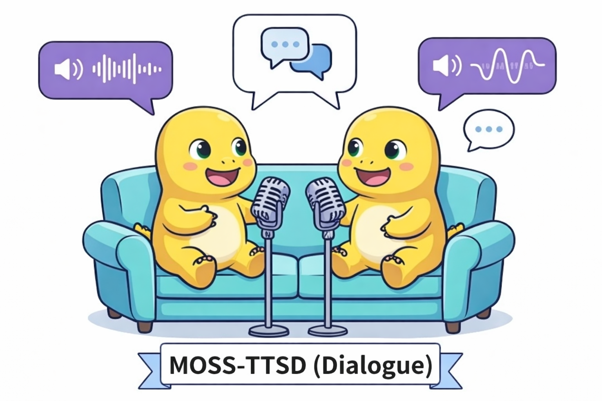

<div align="center">
    <h1>
    MOSS-TTSD: Text to Spoken Dialogue Generation
    </h1>
    <p>
    
    <p>
    </p>
    <a href="https://mosi.cn/models/moss-ttsd"></a>
    <a href="https://mosi.cn/models/moss-ttsd"></a>
    <a href="https://huggingface.co/OpenMOSS-Team/MOSS-TTSD-v1.0"></a>
     <a href="https://huggingface.co/spaces/OpenMOSS-Team/MOSS-TTSD"></a>
    <a href=""></a>
    <a href="https://github.com/"></a>
    <a href="https://github.com/OpenMOSS/MOSS-TTSD"></a>
    <a href="https://github.com/OpenMOSS/MOSS-TTSD"></a>
    <br>

</div>


# MOSS-TTSD🪐

[English](README.md) | [简体中文](README_zh.md)

<!-- **MOSS-TTSD** is a long-form spoken dialogue generation model that enables highly expressive multi-party conversational speech synthesis across multiple languages. It supports continuous long-duration generation, flexible multi-speaker dialogue control, and state-of-the-art zero-shot voice cloning with only short reference audio. MOSS-TTSD is designed for real-world long-form content creation, including podcasts, audiobook, sports and esports commentary, dubbing, crosstalk, and entertainment scenarios. （about）-->


## Overview
 <p align="center">
    
  </p>

MOSS-TTSD is the long-form dialogue specialist within our open-source [MOSS‑TTS Family](https://github.com/OpenMOSS/MOSS-TTS). While foundational models typically prioritize high-fidelity single-speaker synthesis, MOSS-TTSD is architected to bridge the gap between isolated audio samples and cohesive, continuous human interaction.
The model represents a paradigm shift from "text-to-speech" to "script-to-conversation." By prioritizing the flow and emotional nuances of multi-party engagement, MOSS-TTSD transforms static dialogue scripts into dynamic, expressive oral performances. It is designed to serve as a robust backbone for creators and developers who require a seamless transition between distinct speaker personas without sacrificing narrative continuity.
Whether it is capturing the spontaneous energy of a live talk show or the structured complexity of a multilingual drama, MOSS-TTSD provides the stability and expressive depth necessary for professional-grade, long-form content creation in an open-source framework.


## Highlights
- **From Monologue to Dialogue**: Unlike traditional TTS which optimizes for reading, MOSS-TTSD masters the rhythm of conversation. It supports 1 to 5 speakers with flexible control, handling natural turn-taking, overlapping speech patterns, and distinct persona maintenance.
- **Extreme Long-Context Modeling**: moving beyond short-sentence generation, the model is architected for stability over long durations, supporting up to 60 minutes of coherent audio in a single session with consistent identity.
- **Diverse Scenario Adaptation**: fine-tuned for high-variability scenarios including conversational media (AI Podcasts), dynamic commentary (Sports/Esports), and entertainment (Audiobooks, Dubbing, and Crosstalk).
- **Multilingual & Zero-Shot Capabilities**: features state-of-the-art zero-shot voice cloning requiring only short reference audio, with robust cross-lingual performance across major languages including Chinese, English, Japanese, and European languages.


## News 🚀
- **[2026-2-10]** MOSS-TTSD v1.0 is released! MOSS-TTSD v1.0 is officially released! This milestone version redefines long-form synthesis with 60-minute single-session context and support for multi-party interactions. It significantly expands multilingual capabilities and diverse usage scenarios.
 - **[2025-11-01]** MOSS-TTSD v0.7 is released! v0.7 significantly improves audio quality, voice cloning capability, and stability, adds support for 32 kHz high‑quality output, greatly extends single‑pass generation length (960s→1700s).
- **[2025-09-09]** We supported SGLang inference engine to accelerate model inference by up to **16x**.
- **[2025-08-25]** We released the 32khz version of XY-Tokenizer.
- **[2025-08-12]** We add support for streaming inference in MOSS-TTSD v0.5.
- **[2025-07-29]** We provide the SiliconFlow API interface and usage examples for MOSS-TTSD v0.5.
- **[2025-07-16]** We open-source the fine-tuning code for MOSS-TTSD v0.5, supporting full-parameter fine-tuning, LoRA fine-tuning, and multi-node training.
- **[2025-07-04]** MOSS-TTSD v0.5 is released! v0.5 has enhanced the accuracy of timbre switching, voice cloning capability, and model stability.
- **[2025-06-20]** MOSS-TTSD v0 is released! Moreover, we provide a podcast generation pipeline named Podever, which can automatically convert PDF, URL, or long text files into high-quality podcasts.

**Note:** You can still access the previous version, MOSS-TTSD v0.7, in the [legacy v0.7 folder](./legacy/v0.7/README.md).

## Supported Languages

MOSS-TTSD currently supports **20 languages**:

| Language | Code | Flag | Language | Code | Flag | Language | Code | Flag |
|---|---|---|---|---|---|---|---|---|
| Chinese | zh | 🇨🇳 | English | en | 🇺🇸 | German | de | 🇩🇪 |
| Spanish | es | 🇪🇸 | French | fr | 🇫🇷 | Japanese | ja | 🇯🇵 |
| Italian | it | 🇮🇹 | Hebrew | he | 🇮🇱 | Korean | ko | 🇰🇷 |
| Russian | ru | 🇷🇺 | Persian (Farsi) | fa | 🇮🇷 | Arabic | ar | 🇸🇦 |
| Polish | pl | 🇵🇱 | Portuguese | pt | 🇵🇹 | Czech | cs | 🇨🇿 |
| Danish | da | 🇩🇰 | Swedish | sv | 🇸🇪 | Hungarian | hu | 🇭🇺 |
| Greek | el | 🇬🇷 | Turkish | tr | 🇹🇷 |  |  |  |

## Installation

To run MOSS-TTSD, you need to install the required dependencies. You can use pip and conda to set up your environment.

### Using conda

```bash
conda create -n moss_ttsd python=3.12 -y && conda activate moss_ttsd
pip install -r requirements.txt
pip install flash-attn
```

## Usage

### Quick Start

MOSS-TTSD uses a **continuation** workflow: provide reference audio for each speaker, their transcripts as a prefix, and the dialogue text to generate. The model continues in each speaker's identity.

```python
import os
from pathlib import Path
import torch
import soundfile as sf
import torchaudio
from transformers import AutoModel, AutoProcessor

pretrained_model_name_or_path = "OpenMOSS-Team/MOSS-TTSD-v1.0"
audio_tokenizer_name_or_path = "OpenMOSS-Team/MOSS-Audio-Tokenizer"
device = "cuda" if torch.cuda.is_available() else "cpu"
dtype = torch.bfloat16 if device == "cuda" else torch.float32

processor = AutoProcessor.from_pretrained(
    pretrained_model_name_or_path,
    trust_remote_code=True,
    codec_path=audio_tokenizer_name_or_path,
)
processor.audio_tokenizer = processor.audio_tokenizer.to(device)
processor.audio_tokenizer.eval()

attn_implementation = "flash_attention_2" if device == "cuda" else "sdpa"
# If flash_attention_2 is unavailable on your environment, set this to "sdpa".
model = AutoModel.from_pretrained(
    pretrained_model_name_or_path,
    trust_remote_code=True,
    attn_implementation=attn_implementation,
    torch_dtype=dtype,
).to(device)
model.eval()

# --- Inputs ---

prompt_audio_speaker1 = "asset/reference_02_s1.wav"
prompt_audio_speaker2 = "asset/reference_02_s2.wav"
prompt_text_speaker1 = "[S1] In short, we embarked on a mission to make America great again for all Americans."
prompt_text_speaker2 = "[S2] NVIDIA reinvented computing for the first time after 60 years. In fact, Erwin at IBM knows quite well that the computer has largely been the same since the 60s."

text_to_generate = """
[S1] Listen, let's talk business. China. I'm hearing things.
People are saying they're catching up. Fast. What's the real scoop?
Their AI—is it a threat?
[S2] Well, the pace of innovation there is extraordinary, honestly.
They have the researchers, and they have the drive.
[S1] Extraordinary? I don't like that. I want us to be extraordinary.
Are they winning?
[S2] I wouldn't say winning, but their progress is very promising.
They are building massive clusters. They're very determined.
[S1] Promising. There it is. I hate that word.
When China is promising, it means we're losing.
It's a disaster, Jensen. A total disaster.
""".strip()

# --- Load & resample audio ---

target_sr = int(processor.model_config.sampling_rate)
audio1, sr1 = sf.read(prompt_audio_speaker1, dtype="float32", always_2d=True)
audio2, sr2 = sf.read(prompt_audio_speaker2, dtype="float32", always_2d=True)
wav1 = torch.from_numpy(audio1).transpose(0, 1).contiguous()
wav2 = torch.from_numpy(audio2).transpose(0, 1).contiguous()

if wav1.shape[0] > 1:
    wav1 = wav1.mean(dim=0, keepdim=True)
if wav2.shape[0] > 1:
    wav2 = wav2.mean(dim=0, keepdim=True)
if sr1 != target_sr:
    wav1 = torchaudio.functional.resample(wav1, sr1, target_sr)
if sr2 != target_sr:
    wav2 = torchaudio.functional.resample(wav2, sr2, target_sr)

# --- Build conversation ---

reference_audio_codes = processor.encode_audios_from_wav([wav1, wav2], sampling_rate=target_sr)
concat_prompt_wav = torch.cat([wav1, wav2], dim=-1)
prompt_audio = processor.encode_audios_from_wav([concat_prompt_wav], sampling_rate=target_sr)[0]

full_text = f"{prompt_text_speaker1} {prompt_text_speaker2} {text_to_generate}"

conversations = [
    [
        processor.build_user_message(
            text=full_text,
            reference=reference_audio_codes,
        ),
        processor.build_assistant_message(
            audio_codes_list=[prompt_audio]
        ),
    ],
]

# --- Inference ---

batch_size = 1

save_dir = Path("output")
save_dir.mkdir(exist_ok=True, parents=True)
sample_idx = 0
with torch.no_grad():
    for start in range(0, len(conversations), batch_size):
        batch_conversations = conversations[start : start + batch_size]
        batch = processor(batch_conversations, mode="continuation")
        input_ids = batch["input_ids"].to(device)
        attention_mask = batch["attention_mask"].to(device)

        outputs = model.generate(
            input_ids=input_ids,
            attention_mask=attention_mask,
            max_new_tokens=2000,
        )

        for message in processor.decode(outputs):
            for seg_idx, audio in enumerate(message.audio_codes_list):
                sf.write(
                    save_dir / f"{sample_idx}_{seg_idx}.wav",
                    audio.detach().cpu().to(torch.float32).numpy(),
                    int(processor.model_config.sampling_rate),
                )
            sample_idx += 1

```
### Batch Inference

You can use the provided inference script for batch inference. The script automatically uses all visible GPUs. You can control GPU visibility via `export CUDA_VISIBLE_DEVICES=<device_ids>`.

```bash
python inference.py \
  --model_path OpenMOSS-Team/MOSS-TTSD-v1.0 \
  --codec_model_path OpenMOSS-Team/MOSS-Audio-Tokenizer \
  --input_jsonl /path/to/input.jsonl \
  --save_dir outputs \
  --mode voice_clone_and_continuation \
  --batch_size 1 \
  --text_normalize
```

Parameters:

- `--model_path`: Path or HuggingFace model ID for MOSS-TTSD.
- `--codec_model_path`: Path or HuggingFace model ID for MOSS-Audio-Tokenizer.
- `--input_jsonl`: Path to the input JSONL file containing dialogue scripts and speaker prompts.
- `--save_dir`: Directory where the generated audio files will be saved.
- `--mode`: Inference mode. Choices: `generation`, `continuation`, `voice_clone`, `voice_clone_and_continuation`. We recommend using `voice_clone_and_continuation` for the best voice cloning experience.
- `--batch_size`: Number of samples per batch (default: `1`).
- `--max_new_tokens`: Maximum number of new tokens to generate. Controls total generated audio length (1s ≈ 12.5 tokens).
- `--temperature`: Sampling temperature (default: `1.1`).
- `--top_p`: Top-p sampling threshold (default: `0.9`).
- `--top_k`: Top-k sampling threshold (default: `50`).
- `--repetition_penalty`: Repetition penalty (default: `1.1`).
- `--text_normalize`: Normalize input text (**recommended to always enable**).
- `--sample_rate_normalize`: Resample prompt audios to the lowest sample rate before encoding (**recommended when using 2 or more speakers**).

#### JSONL Input Format

The input JSONL file should contain one JSON object per line. MOSS-TTSD supports 1 to 5 speakers per dialogue. Use `[S1]`–`[S5]` tags in the `text` field and provide corresponding `prompt_audio_speakerN` / `prompt_text_speakerN` pairs for each speaker:
```json
{
  "base_path": "/path/to/audio/files",
  "text": "[S1]Speaker 1 dialogue[S2]Speaker 2 dialogue[S3]...[S4]...[S5]...",
  "prompt_audio_speaker1": "path/to/speaker1_audio.wav",
  "prompt_text_speaker1": "Reference text for speaker 1 voice cloning",
  "prompt_audio_speaker2": "path/to/speaker2_audio.wav",
  "prompt_text_speaker2": "Reference text for speaker 2 voice cloning",
  "...": "...",
  "prompt_audio_speaker5": "path/to/speaker5_audio.wav",
  "prompt_text_speaker5": "Reference text for speaker 5 voice cloning"
}
```
## Evaluation
### Objective Evaluation(TTSD-eval)

We introduce a robust evaluation framework leveraging MMS-FA for word-level alignment and utterance segmentation and wespeaker for embedding extraction to derive Speaker Attribution Accuracy (ACC) and Speaker Similarity (SIM).
Code and data coming soon.

<br>

| Model | ZH - SIM | ZH - ACC | ZH - WER | EN - SIM | EN - ACC | EN - WER |
| :--- | :---: | :---: | :---: | :---: | :---: | :---: |
| **Comparison with Open-Source Models** | | | | | | |
| MOSS-TTSD | **0.7949** | **0.9587** | **0.0485** | **0.7326** | **0.9626** | 0.0988 |
| MOSS-TTSD v0.7 | 0.7423 | 0.9391 | 0.0517 | 0.6743 | 0.9266 | 0.1612 |
| Vibevoice 7B | 0.7590 | 0.9222 | 0.0570 | 0.7140 | 0.9554 | **0.0946** |
| Vibevoice 1.5 B | 0.7415 | 0.8798 | 0.0818 | 0.6961 | 0.9353 | 0.1133 |
| FireRedTTS2 | 0.7383 | 0.9022 | 0.0768 | - | - | - |
| Higgs Audio V2 | - | - | - | 0.6860 | 0.9025 | 0.2131 |
| **Comparison with Proprietary Models** | | | | | | |
| Eleven V3 | 0.6970 | 0.9653 | **0.0363** | 0.6730 | 0.9498 | **0.0824** |
| MOSS-TTSD (elevenlabs_voice) | **0.8165** | **0.9736** | 0.0391 | **0.7304** | **0.9565** | 0.1005 |
| | | | | | | |
| gemini-2.5-pro-preview-tts | - | - | - | 0.6786 | 0.9537 | **0.0859** |
| gemini-2.5-flash-preview-tts | - | - | - | 0.7194 | 0.9511 | 0.0871 |
| MOSS-TTSD (gemini_voice) | - | - | - | **0.7893** | **0.9655** | 0.0984 |
| | | | | | | |
| Doubao_Podcast | 0.8034 | 0.9606 | **0.0472** | - | - | - |
| MOSS-TTSD (doubao_voice) | **0.8226** | **0.9630** | 0.0571 | - | - | - |

### Subjective Evaluation
For open-source models, annotators are asked to score each sample pair in terms of speaker attribution accuracy, voice similarity, prosody, and overall quality. Following the methodology of the LMSYS Chatbot Arena, we compute Elo ratings and confidence intervals for each dimension.


For closed-source models, annotators are only asked to choose the overall preferred one in each pair, and we compute the win rate accordingly.


## License

MOSS-TTSD is released under the Apache 2.0 license.

## Citation

```
@article{moss2025ttsd,
  title={Text to Spoken Dialogue Generation},
  author={OpenMOSS},
  year={2025}
}
```

## ⚠️ Usage Disclaimer

This project provides an open-source spoken dialogue synthesis model intended for academic research, educational purposes, and legitimate applications such as AI podcast production, assistive technologies, and linguistic research. Users must not use this model for unauthorized voice cloning, impersonation, fraud, scams, deepfakes, or any illegal activities, and should ensure compliance with local laws and regulations while upholding ethical standards. The developers assume no liability for any misuse of this model and advocate for responsible AI development and use, encouraging the community to uphold safety and ethical principles in AI research and applications. If you have any concerns regarding ethics or misuse, please contact us.

<br>

# MOSS-TTS Family

## Introduction

<p align="center">
  
</p>

When a single piece of audio needs to **sound like a real person**, **pronounce every word accurately**, **switch speaking styles across content**, **remain stable over tens of minutes**, and **support dialogue, role‑play, and real‑time interaction**, a single TTS model is often not enough. The **MOSS‑TTS Family** breaks the workflow into five production‑ready models that can be used independently or composed into a complete pipeline.

- **MOSS‑TTS**: MOSS-TTS is the flagship production TTS foundation model, centered on high-fidelity zero-shot voice cloning with controllable long-form synthesis, pronunciation, and multilingual/code-switched speech. It serves as the core engine for scalable narration, dubbing, and voice-driven products.
- **MOSS‑TTSD**: MOSS-TTSD is a production long-form dialogue model for expressive multi-speaker conversational audio at scale. It supports long-duration continuity, turn-taking control, and zero-shot voice cloning from short references for podcasts, audiobooks, commentary, dubbing, and entertainment dialogue.
- **MOSS‑VoiceGenerator**: MOSS-VoiceGenerator is an open-source voice design model that creates speaker timbres directly from free-form text, without reference audio. It unifies timbre design, style control, and content synthesis, and can be used standalone or as a voice-design layer for downstream TTS.
- **MOSS‑SoundEffect**: MOSS-SoundEffect is a high-fidelity text-to-sound model with broad category coverage and controllable duration for real content production. It generates stable audio from prompts across ambience, urban scenes, creatures, human actions, and music-like clips for film, games, interactive media, and data synthesis.
- **MOSS‑TTS‑Realtime**: MOSS-TTS-Realtime is a context-aware, multi-turn streaming TTS model for real-time voice agents. By conditioning on dialogue history across both text and prior user acoustics, it delivers low-latency synthesis with coherent, consistent voice responses across turns.

## Released Models

| Model | Architecture | Size | Model Card | Hugging Face | ModelScope |
|---|---|---:|---|---|---|
| **MOSS-TTS** | `MossTTSDelay` | 8B | [](https://github.com/OpenMOSS/MOSS-TTS/blob/main/docs/moss_tts_model_card.md) | [](https://huggingface.co/OpenMOSS-Team/MOSS-TTS) | [](https://modelscope.cn/models/openmoss/MOSS-TTS) |
|  | `MossTTSLocal` | 1.7B | [](https://github.com/OpenMOSS/MOSS-TTS/blob/main/docs/moss_tts_model_card.md) | [](https://huggingface.co/OpenMOSS-Team/MOSS-TTS-Local-Transformer) | [](https://modelscope.cn/models/openmoss/MOSS-TTS-Local-Transformer) |
| **MOSS‑TTSD‑V1.0** | `MossTTSDelay` | 8B | [](https://github.com/OpenMOSS/MOSS-TTS/blob/main/docs/moss_ttsd_model_card.md) | [](https://huggingface.co/OpenMOSS-Team/MOSS-TTSD-v1.0) | [](https://modelscope.cn/models/openmoss/MOSS-TTSD-v1.0) |
| **MOSS‑VoiceGenerator** | `MossTTSDelay` | 1.7B | [](https://github.com/OpenMOSS/MOSS-TTS/blob/main/docs/moss_voice_generator_model_card.md) | [](https://huggingface.co/OpenMOSS-Team/MOSS-VoiceGenerator) | [](https://modelscope.cn/models/openmoss/MOSS-VoiceGenerator) |
| **MOSS‑SoundEffect** | `MossTTSDelay` | 8B | [](https://github.com/OpenMOSS/MOSS-TTS/blob/main/docs/moss_sound_effect_model_card.md) | [](https://huggingface.co/OpenMOSS-Team/MOSS-SoundEffect) | [](https://modelscope.cn/models/openmoss/MOSS-SoundEffect) |
| **MOSS‑TTS‑Realtime** | `MossTTSRealtime` | 1.7B | [](https://github.com/OpenMOSS/MOSS-TTS/blob/main/docs/moss_tts_realtime_model_card.md) | [](https://huggingface.co/OpenMOSS-Team/MOSS-TTS-Realtime) | [](https://modelscope.cn/models/openmoss/MOSS-TTS-Realtime) |
